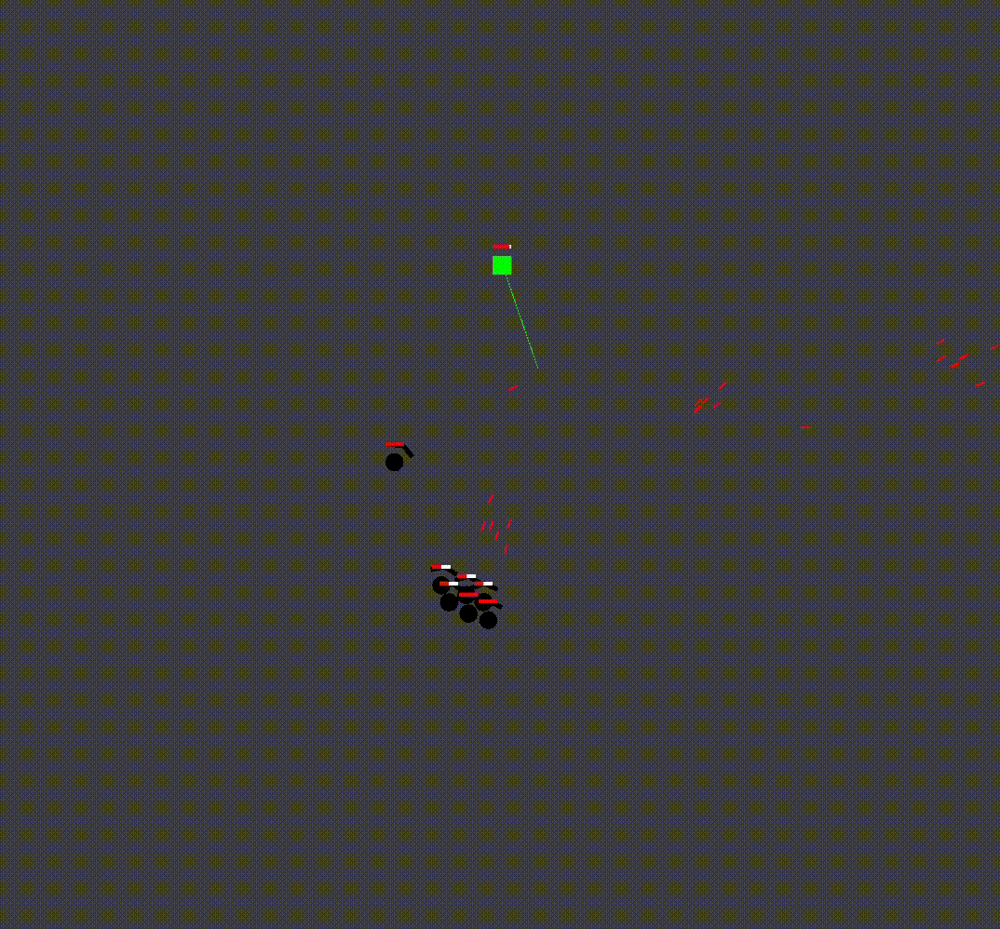

Kotlin couch co-op game, where players control their character by tilting their phone!

An early preview can be found below. 

Player can additionally aim and shoot using a floating joystick.

The game features a physics system allowing for many entities at once and swarms of enemies attacking the players.

Project initialized using [gdx-liftoff](https://github.com/libgdx/gdx-liftoff).
